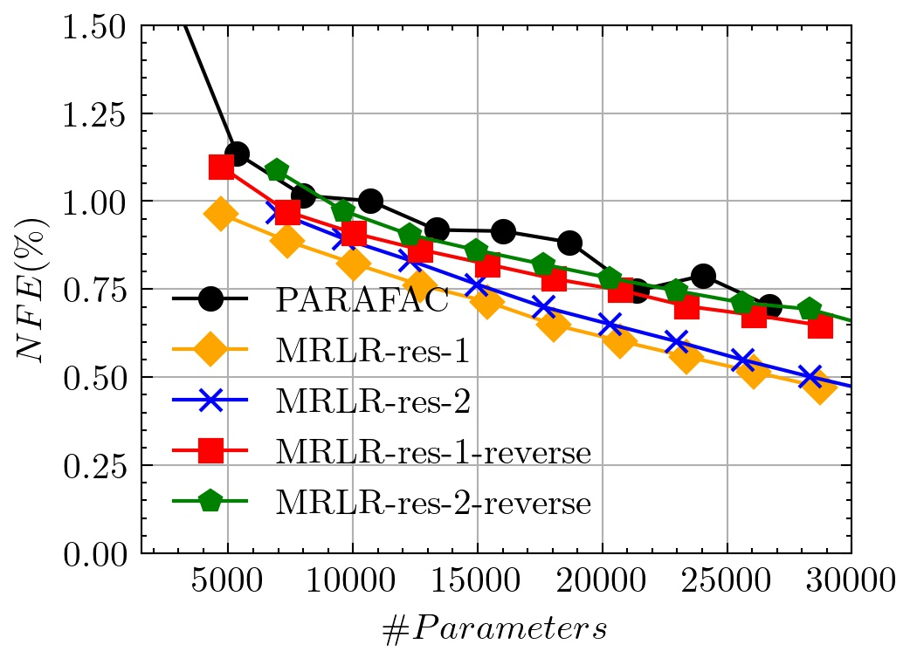

# A Multi-resolution Low-rank Tensor Decomposition

by
Sergio Rozada,
and Antonio G. Marques

This code belongs to a paper that has been published in *ICASSP 2022*.

> The associated paper presents a multi-resolution low-rank (MRLR) tensor decomposition to approximate tensors in a hierarchical fashion. The MRLR decomposition outperforms the PARAFAC decomposition in various setups.

<p align="center">
    
</p>


* Normalized Frobenius Error (NFE) between the original tensor and the approximated tensor via
the proposed decomposition (MRLR), and the PARAFAC decomposition.*


## Abstract

> The (efficient and parsimonious) decomposition of higher-order tensors is a fundamental problem with numerous applications in a variety of fields. Several methods have been proposed in the literature to that end, with the Tucker and PARAFAC decompositions being the most prominent ones. Inspired by the latter, in this work we propose a multi-resolution low-rank tensor decomposition to describe (approximate) a tensor in a hierarchical fashion. The central idea of the decomposition is to recast the tensor into multiple lower-dimensional tensors to exploit the structure at different levels of resolution. The method is first explained, an alternating least squares algorithm is discussed, and preliminary simulations illustrating the potential practical relevance are provided.


## Software implementation

The repository is organized as follows:
* ```data```: contains the two data sources used in the experiments.
* ```results```: contains the three pictures with the results of the experiments.
* ```utils.py```: some tensor ancillary functions.
* ```test_aminoacids.py```: code to obtain Fig. 1 of the paper.
* ```test_video.py```: code to obtain Fig. 2 of the paper.
* ```test_function.py```: code to obtain Fig. 3 of the paper.


## Getting the code

You can download a copy of all the files in this repository by cloning the
[git](https://github.com/sergiorozada12/mrlr-tensor-decomposition) repository:

    git clone https://github.com/sergiorozada12/mrlr-tensor-decomposition.git

or [download a zip archive](https://github.com/sergiorozada12/mrlr-tensor-decomposition/archive/refs/heads/main.zip).


## Dependencies

You'll need a working Python environment to run the code.
The recommended way to set up your environment is through [virtual environments](https://docs.python.org/3/library/venv.html). The required dependencies are specified in the file `requirements.txt`.
